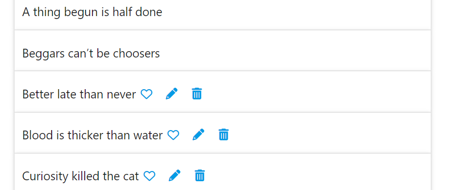

# [WhiteHair](https://white-hair.herokuapp.com/)

This is a proverbs website created in Django as a 4th portfolio project for the **Full stack Software Develompent** course from **[Code Institute](https://codeinstitute.net/)**

A proverb is a simple and insightful, traditional saying that expresses a perceived truth based on common sense or experience.

Whitehair website is designed to be the place where anyone can join to share and enjoy proverbs from all over the world

## Table of contents

1. [UX](#UX)
    - [User Stories](#User-Stories)
    - [Wireframes](#Wireframes)
    - [Database schema](#Database-schema)
    - [Style and colours](#Style-and-colours)
2. [Features](#Features)
    - [Existing Features](#Existing-Features)
        - [Proverb](#Proverb)
        - [List of all proverbs](#List-of-proverbs)
        - [Add proverbs](#Add-proverbs)
        - [Manage own proverbs](#Manage-own-proverbs)
        - [Navigation](#Navigation)
        - [The footer](#The-footer)
        - [404 and 500 error pages](#404-and-500-error-pages)
        - [Site admin](#Site-admin)
    - [Future Features](#Future-Features)
        - [Favorite proverbs](#Favorite-proverbs)
        - [Other future features](#Other-future-features)
3. [Technologies Used](#Technologies-Used)
4. [Testing](#Testing)
5. [Deployment](#Deployment)
6. [Credits](#Credits)

## UX

Whitehair website was created using a Design Thinking and Agile approach.

For the Agile methodology GitHub Projects was used as a kanban board. The user stories were added as [issues](https://github.com/ChrisT-CC/whitehair/issues), prioritised and automated to move to "To Do" column in [Whitehair project](https://github.com/ChrisT-CC/whitehair/projects/2). The issues are assign to the contributors (or contributor) and can be commented on.

In "To Do" column individual task cards with subtasks checkboxes were also added to better keep track of the project's workflow

From "To Do" column the cards were moved to the "In progress" column based on current tasks

From "In progress" column, the cards were moved to "Done" column when the tasks were finished and tested

At the end of the project the issues can be closed. The remaining issues, if there are any, can be reassesed and relabeld (as future feature for example). In this project, the issues were not closed to be able to be used as proof of work.

---

### User Stories

The user stories below were used as a guide to complete this project.
Other user stories labeled "Should Have" were created but they were not implemented at the time of submission.

**As a new user:**

- I can view a proverb so that I can read it and enjoy it
- I can click on a proverb so that I can see the meaning
- I can view a list of proverbs so that I can choose one to read
- I can register an account so that I can interact better with the website

**As a registered user:**

- I can create, read, update and delete proverbs so that I can contribute to the website content

**As site admin:**

- I can log in with all permissions so that I can manage both users and proverbs

[Back to top](#Table-of-contents)

---

### Wireframes

The wireframes were created in Balsamiq. They were used to set an impression of how the website should look. Only 3 basic wireframes were made for home page, login and proverbs because other use simple forms or they have a simple style.

#### **Home page**

#### **Proverbs page**

#### **Login page**

[Back to top](#Table-of-contents)

---

### Database schema

A PostgreSQL database was used with one custom table "Proverb" and Django's "User" table.

Content field is for the proverb's content and has a max 200 characters to accomodate longer proverbs. They are usually short but the longest found was around 150 characters. This field is **Unique**

Upon Django doc research a custom id was not created, instead the autogenerated one was used.

The author field id Foreign Key and is Django's User's username. After some bugs the field was set as not editable. Logic set its value in app.

[Back to top](#Table-of-contents)

---

### Style and colours

Whitehair website uses minimum styling and colours and it had no images at the time of submission.

Materialize classes and features were used to generate the look and the colours of website.

[Back to top](#Table-of-contents)

---

## Features

### Existing Features

- #### Proverb

Whitehair's homepage contains a randomly generated proverb in a Materialize collapsible accorion popout. On hover the cursor changes to indicate an action. On click Collapsible's body appears to show the meaning of the proverb.

[Back to top](#Table-of-contents)

---

- #### List of all proverbs

This feature display for user a list of all proverbs in a Materialize collapsible accorion popout. If the user is logged the list adds buttons for CRUD operations.

[Back to top](#Table-of-contents)

---

- #### Add proverbs

If the user is logged a new menu item "Add proverbs" apperears. That leads to add proverbs page. Here a user can add his own proverbs in a ModelForm rendered as a Materialize form. The author field is missing here, but logic was implemented so that the curent user is added as author. User friendly lables were used in this form.

[Back to top](#Table-of-contents)

---

- #### Manage own proverbs

If the user is logged the list of proverbs adds buttons with font awsome icons for CRUD operations. Here the user can edit or delete his own proverbs.

The pencil button leads to a prepopulated edit form.

The bin button deletes the proverb and leads the user to the main page.

#### **Important** Defensive programing

On deletion there is no feedback or warning. A modal was considered to remind the user that this is a permanent delete from the database, but at the time of submission this functionality was not added yet.

[Back to top](#Table-of-contents)

---

- #### Navigation

A Materialize mobile collapsible navbar was used with limited options for an unregistered user.

When the user is logged in extra options apper in the menu.

On small screens the navbar changes into a sidebar menu with a burger icon.

[Back to top](#Table-of-contents)

---

- #### The footer

Whitehair website has a simple sticky footer with a disclaimer. More content (like social media icons, misc info or forms) can be added to the footer, but it wasn't used in this proverb as it's behind the scope of this project.

[Back to top](#Table-of-contents)

---

- #### 404 and 500 error pages

404 and 500 pages were added to the project to guide the user in case of problems. The design of this pages is very simple as it wasn't considered important for this project. More important is The method to implement this pages in Django.

404 page

500 page

[Back to top](#Table-of-contents)

---

- #### Site admin

Django admin was used in this website with no customisations.

### Future Features

- #### Favorite proverbs

This was initialy priritised as must have, however at the day of submission it was not implemented, so it was reprioritised as should have.

The heart icon was left intentionally. A link to comming soon page can be implemented.

[Back to top](#Table-of-contents)

---

- #### Other future features

    - categories (coding, animals, love, military, family, wise and many more)
    - languages
    - share button
    - admin approved proverbs

[Back to top](#Table-of-contents)

---

## Technologies Used

- [Django](https://www.djangoproject.com/) framework used to build the project
- [Python](https://www.python.org/) used to write all the code
- [javascript](https://www.javascript.com/) used to initiate materialize components
- [CSS](https://en.wikipedia.org/wiki/CSS) used for custom styling
- [HTML](https://en.wikipedia.org/wiki/HTML) used for creating templates
- [Materialize](https://materializecss.com/) used to style the project
- [Font Awesome](https://fontawesome.com/) used for icons
- [Chrome Dev Tools](https://developers.google.com/web/tools/chrome-devtools) used for manual testing and responsiveness
- [GitHub](https://github.com/) used to host repo
- [Git](https://git-scm.com/) used for version control
- [Gitpod](https://www.gitpod.io/) used as IDE
- [Heroku](https://dashboard.heroku.com/apps) used for deployment
- [Draw.io](https://app.diagrams.net/) used to create ERD
- [Cloudinary](https://cloudinary.com/) used to store static files
- [Icon8](https://icons8.com/) used for favicon
- [AmIResponsive](http://ami.responsivedesign.is/) used for responsive image mockup
- [PostgreSQL](https://www.postgresql.org/) as database

[Back to top](#Table-of-contents)

---

## Testing

Testing was done manually. Chrome Dev Tools was used extensively first to see how everything looks (positioning and styling) and for responsivness. 

Whenever there were errors in code 

[Back to top](#Table-of-contents)

---

## Deployment

The project's repo was hosted on GitHub and it was deployed on Heroku, because GitHub Pages can only handle front-end files.

- Create a Heroku app
- Attach the PostgreSQL database
- Prepare environment and settings.py
- Set up Cloudinary for static files
- Connect Heroku To GitHub
- Set up automatic deployment

[Back to top](#Table-of-contents)

---

## Credits

### Content

Code Institute's [Gitpod full template](https://github.com/Code-Institute-Org/gitpod-full-template) was used to to create this project.

Code Institute's walkthrough projects "Hello Django", I "Think therefore I blog" and the Flask walkthrough app.

### Acknowledgements

Thanks to my mentor for help, suggetions and time

Thanks to Ger and Sean from CI Tutor assistance for help with static files not loading

Thanks to my family, friends and peers for suggestions, reviews and feedback.

[Back to top](#Table-of-contents)

---

*Disclaimer: This project is for learning purposes only*
